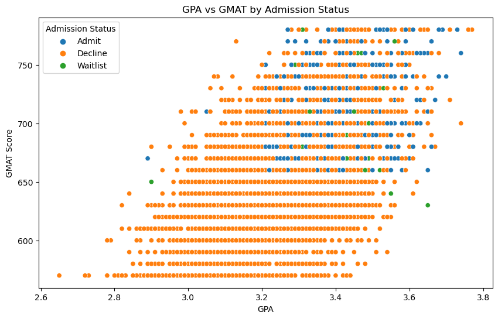
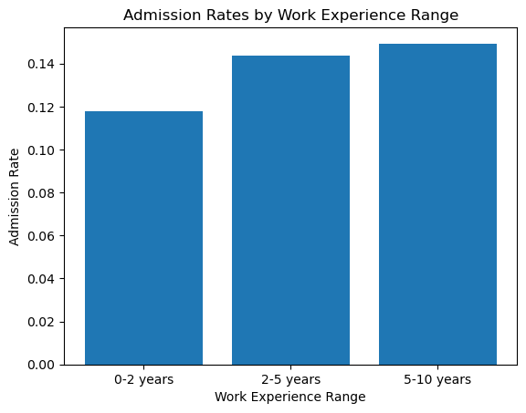
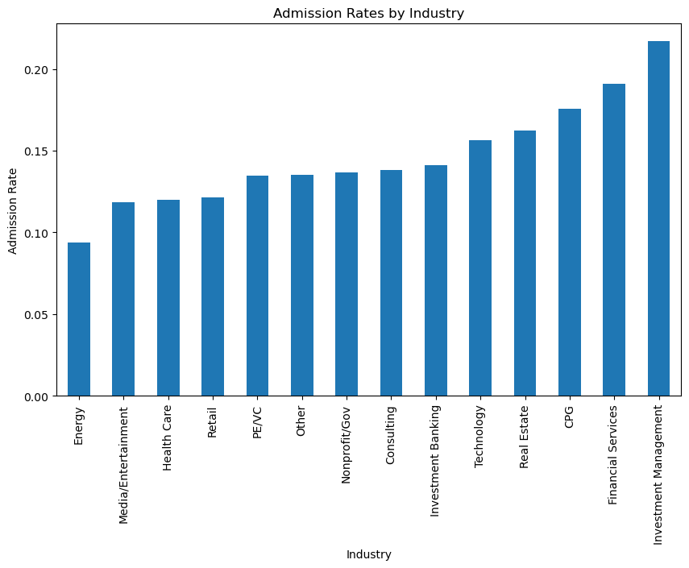
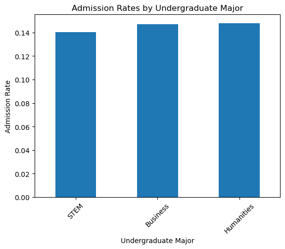
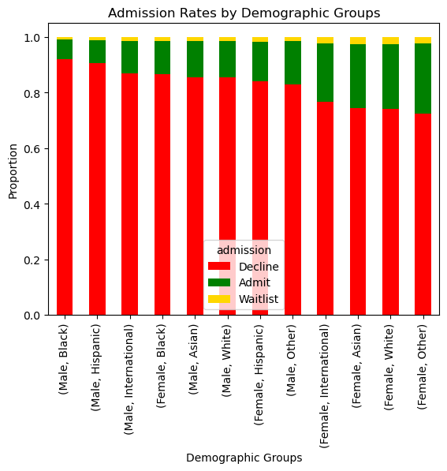

# MBA-Admission-Analytics
## Project Introduction

As someone interested in the decision-making behind competitive graduate programs, I was curious to explore what factors might influence admission into the Wharton School of Business—one of the top MBA programs in the U.S. Through this project, I aim to uncover data-driven insights on how elements like GPA, GMAT scores, work experience, and demographics relate to admission outcomes. My goal is to better understand the admissions landscape and share findings that may be helpful for prospective applicants.

## Dataset & Project Files
- Raw dataset: [`data/raw_data.csv`](raw_data.csv) (6,194 applications, synthetic from Wharton Class of 2025)  
- Full analysis notebook: [`notebooks/MBA_Admission_Analysis.ipynb`](MBA_Admission_Analysis.ipynb)  
- Exported visuals: see [`plots/`](plots) folder  

## Research Questions
Some research questions I use to guide the exploratory stage are:

1. How do GPA and GMAT scores correlate with admission status?
2. Are applicants from certain undergraduate majors (Business, STEM) more likely to be admitted?
3. What is the distribution of admission across gender, race, and international status?
4. Does demographic background impact admission rates?
5. Does the number of years of work experience correlate with higher admission rates?
6. Which industries have the highest proportion of admitted applicants?

## Key Insights
**1. GPA & GMAT:**
- Both GPA and GMAT scores are positively correlated with admission outcomes, meaning applicants with higher academic performance and stronger test scores tend to be admitted at higher rates.  
- Correlation analysis shows that GMAT (correlation coefficient 0.35) is a stronger driver of admission than GPA (0.28). This suggests that while both matter, admissions committees may weigh standardized test scores more heavily than academic GPA when making decisions.  
- The scatterplot below illustrates this relationship. Admitted applicants (orange) are generally clustered toward higher GMAT scores, while declined applicants are concentrated in the lower GMAT range. GPA shows a similar but weaker separation.  

**2. Work Experience**  
- Work experience demonstrates a clear threshold effect. Applicants with at least two years of professional experience were admitted at higher rates compared to those with less than two years.  
- Admission rates increased from ~12% for applicants with 0–2 years of experience, to ~14–15% for those with 2–10 years. Beyond 5 years, the increase plateaus, suggesting diminishing returns after a certain point.  
- This implies admissions committees may view professional experience as a critical qualification, but additional years beyond a threshold do not dramatically improve chances.  

  

**3. Industry Background**  
- Admission rates vary significantly by applicant industry. Investment Management (21.7%) and Financial Services (19.1%) had the highest admission rates, while Energy had the lowest (9.4%).  
- This indicates that applicants from industries with stronger ties to MBA programs may be viewed more favorably, either due to alignment with business school career pipelines or transferable skill sets.  
- The bar chart below shows how industry background influences admission outcomes.  

  

**4. Undergraduate Majors**  
- Admission rates across undergraduate majors (Business, STEM, Humanities) were broadly similar, averaging around 14%.  
- A one-way ANOVA test confirmed there were **no statistically significant differences** between the groups (F = 0.28, p = 0.76). This suggests that, in this dataset, an applicant’s field of undergraduate study was **not a determining factor** in admissions decisions.  
- The chart below illustrates the nearly identical admission rates across majors.  

**5. Demographic Patterns**  
- Admission outcomes differed across demographic groups. The stacked bar chart shows that female applicants were admitted at higher rates than male applicants across most racial categories, while Black and Hispanic applicants had noticeably lower admit proportions compared to White and Other groups.  
- To test these patterns formally, I ran a logistic regression model using gender and race as predictors. The model assigned positive coefficients to female and White/Other applicants, and negative coefficients to Black and Hispanic applicants. However, the overall predictive power was limited (66% accuracy), reflecting both **class imbalance** in the dataset and the absence of other admissions factors (e.g., essays, recommendations, interviews).  
- This analysis should therefore be read as a reflection of dataset imbalances and representation differences, rather than evidence of bias or causation.  

## Application Recommendation
- Applicants may benefit from strengthening academic metrics (GPA, GMAT).  
- Gaining at least 2 years of work experience is beneficial before applying to MBA programs.  
- Industry background may shape perceived fit.
  
## Limitations Acknowledgement
- The dataset is synthetic, which limits generalizability.  
- Admissions decisions depend on unobserved factors such as essays, recommendations, and interviews.  
- Logistic regression performance was constrained by class imbalance, making predictions less reliable.  

## Tools & Libraries
- **Programming Language:** Python  
- **Libraries:** Pandas, NumPy, Scikit-learn, Matplotlib, Seaborn  
- **Environment:** Jupyter Notebook  
